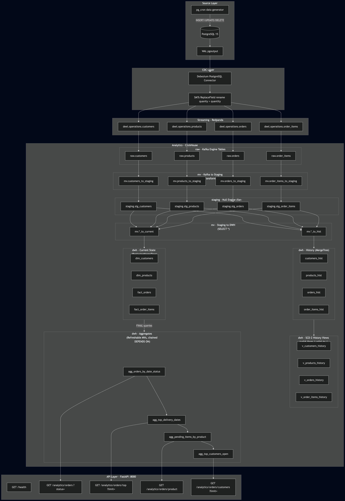

# ACME Delivery Services Analytics Platform

A CDC-based streaming analytics platform for monitoring ACME delivery orders with low latency. Data flows from the operational PostgreSQL database through Debezium and Redpanda into ClickHouse, where it is served via a FastAPI REST API.

### How This Solves the Task Requirements

| Requirement | Solution |
|---|---|
| Historical + current state data | ClickHouse `*_hist` tables (append-only audit trail) + `ReplacingMergeTree` current-state tables with FINAL deduplication + SCD-2 views (`v_customers_history`, `v_products_history`, `v_orders_history`, `v_order_items_history`) with `valid_from`/`valid_to`/`is_current` |
| Dimensional data model | `dim_customers`, `dim_products`, `dim_date`, `dim_order_status`, `fact_orders`, `fact_order_items` |
| Data available ASAP | CDC streaming pipeline - no batch ETL, changes propagate in seconds |
| Business query endpoints | 4 pre-computed aggregate tables refreshed every 5s, served via FastAPI |

## Architecture



**Data flow through the layers:**

1. **Source - PostgreSQL 15**: Operational database with `pg_cron` auto-generating orders, customers, and products every 1–2 minutes
2. **CDC - Debezium**: Captures WAL changes via `pgoutput`. Single Message Transforms (SMTs) rename the source typo `quanity` to `quantity`, extract new record state, and cast types
3. **Streaming - Redpanda**: Kafka-compatible broker receives 4 topics (`deel.operations.customers`, `products`, `orders`, `order_items`)
4. **Analytics - ClickHouse**: Kafka Engine tables consume topics to MVs transform and write to Null engine staging tables to downstream MVs fan out each event to current-state and history tables to refreshable MVs pre-compute business aggregates
5. **API - FastAPI**: Queries pre-computed aggregates with sub-millisecond response times

## Tech Stack

| Component | Technology | Purpose |
|---|---|---|
| Source DB | PostgreSQL 15 | Operational database + pg_cron data generation |
| CDC | Debezium 3.0 | Change Data Capture from WAL |
| Message Broker | Redpanda | Kafka-compatible streaming (lightweight, single binary) |
| Analytics DWH | ClickHouse | Columnar OLAP database |
| API | FastAPI | REST API for analytics queries |
| Orchestration | Docker Compose | Single-command deployment of all services |

## Project Structure

```
.
├── api/
│   ├── Dockerfile
│   ├── main.py                        # FastAPI application (5 endpoints)
│   └── requirements.txt
├── clickhouse/
│   ├── config.xml                     # ClickHouse server config
│   ├── kafka.xml                      # Kafka engine connection settings
│   ├── keeper_config.xml              # ClickHouse Keeper config
│   ├── users.xml                      # User permissions
│   └── sql/
│       ├── 00_create_schemas.sql      # raw, mv, dwh schemas
│       ├── 01_raw_kafka_tables.sql    # Kafka Engine consumer tables
│       ├── 02_dwh_current_tables.sql  # ReplacingMergeTree current-state
│       ├── 03_dwh_history_tables.sql  # MergeTree append-only history
│       ├── 04_staging_tables.sql      # Null engine staging tables (transformation fan-out)
│       ├── 05_dim_date.sql            # Date dimension (generated calendar)
│       ├── 06_dim_order_status.sql    # Order status lookup dimension
│       ├── 07_materialized_views.sql  # Raw to staging to current + history routing
│       ├── 08_views_current.sql       # v_* convenience views (FINAL + soft-delete filter)
│       ├── 09_aggregates.sql          # Refreshable MVs for business queries
│       └── 10_scd2_views.sql          # SCD Type 2 views (valid_from/valid_to/is_current)
├── connector-configs/
│   ├── postgres-source.json           # Debezium connector configuration
│   ├── create-connector.sh            # Register connector with Kafka Connect
│   ├── check-status.sh               # Verify connector health
│   └── update-connector.sh           # Update connector config
├── db-scripts/
│   └── initialize_db_ddl.sql          # PostgreSQL schema + pg_cron jobs
├── docker/
│   └── postgres-db/                   # Custom Postgres image (with pg_cron)
├── diagrams/
│   ├── architecture.png               # System architecture diagram
│   └── database-diagram.png           # ClickHouse data model diagram
├── tests/
│   ├── run-tests.sh                   # Test runner script
│   ├── conftest.py                    # Shared fixtures
│   ├── test_cdc_pipeline.py           # CDC pipeline integration tests (9 tests)
│   ├── test_business_queries.py       # Business query tests (5 tests)
│   └── test_api.py                    # API endpoint tests (5 tests)
├── docker-compose.yaml
├── restart.sh                         # Full teardown + rebuild
├── uninstall.sh                       # Remove all containers, volumes, images
└── README.md
```

## Data Model


The ClickHouse schema is organized in three layers:

### `raw.*` - Kafka Engine Tables
Ephemeral consumers that read from Redpanda topics. Data is consumed exactly once by the attached materialized views - no data is stored in these tables.

### `staging.*` - Null Engine Staging Tables
Intermediate layer using ClickHouse's Null engine (stores nothing, zero disk cost). Each Kafka table has one MV with transformation logic that writes to a staging table. The staging table then triggers two downstream MVs (`SELECT *`) — one to the current-state table and one to the history table. This ensures transformation logic exists in exactly one place (DRY), while data fans out to both write paths.

Data flow: `raw.*_kafka` => `[MV: transforms]` => `staging.stg_* (Null)` => `[MV: SELECT *]` => `dwh.* + dwh.*_hist`

### `dwh.*` - Dimensions

**CDC-sourced dimensions** (`dim_customers`, `dim_products`):
- `ReplacingMergeTree` engine with `cdc_source_ts_ms` as version column
- Soft-delete support via `cdc_deleted` flag
- Query with `FINAL` keyword for deduplicated results

**Static dimensions**:
- `dim_date` — pre-generated calendar dimension (2024–2028) with year, quarter, month, day_of_week, is_weekend
- `dim_order_status` — order status lookup with `status_group` ('open'/'terminal') and `is_terminal` flag, used as single source of truth by aggregate queries

**Facts** (`fact_orders`, `fact_order_items`):
- `ReplacingMergeTree` with CDC deduplication, same pattern as dimensions

**History** (`dim_customers_hist`, `dim_products_hist`, `fact_orders_hist`, `fact_order_items_hist`):
- `MergeTree` engine (append-only)
- Every CDC event recorded with `_inserted_at` timestamp
- Full audit trail

### CDC Metadata Columns

All CDC-sourced tables include these audit columns:
- `cdc_deleted` (UInt8) — soft-delete flag (1 = deleted in source)
- `cdc_op` (String) — CDC operation type: `r` = snapshot read, `c` = create, `u` = update, `d` = delete. Used for audit trail analysis (e.g. count of updates vs creates per entity)
- `cdc_source_ts_ms` (Int64) — source database transaction timestamp in milliseconds, used as version column for ReplacingMergeTree deduplication

### `dwh.v_*` - Convenience Views

**Current-state views** (`v_customers_current`, `v_orders_current`, etc.) apply `FINAL` and filter `cdc_deleted = 0` automatically.

**SCD Type 2 views** (`v_customers_history`, `v_products_history`, `v_orders_history`, `v_order_items_history`) provide classic slowly-changing dimension columns computed from history tables:
- `valid_from` — when this version became effective
- `valid_to` — when it was superseded (`9999-12-31` for current)
- `is_current` — convenience flag for the latest version

### `dwh.agg_*` - Refreshable Materialized Views
Pre-computed business aggregates, refreshed every **5 seconds**:
- `agg_orders_by_date_status` - orders grouped by delivery date and status
- `agg_top_delivery_dates` - delivery dates ranked by open order count
- `agg_pending_items_by_product` - pending item quantities per product
- `agg_top_customers_open` - customers ranked by open order count

The API reads directly from these tables, resulting in sub-millisecond response times.

## Getting Started

### Prerequisites

- Docker and Docker Compose

### Launch

```bash
# Copy the example environment file
cp .env.example .env

# Start the entire stack (all services including CDC connector register automatically)
docker-compose up -d

# Wait for all services to be healthy (~30-60 seconds)
docker-compose ps
```

The `connect-init` container automatically registers the Debezium connector once Kafka Connect is healthy. Data starts flowing automatically - `pg_cron` generates new orders every minute and updates customers/products every 2 minutes.

### Verify It Works

```bash
# Check ClickHouse has data (may take 30s after connector registration)
docker exec clickhouse clickhouse-client \
  --query "SELECT count() FROM dwh.fact_orders FINAL WHERE cdc_deleted = 0 LIMIT 10;"

# Check the API
curl http://localhost:8000/health
curl http://localhost:8000/analytics/orders
```

### Service Ports

| Service | Port | URL |
|---|---|---|
| FastAPI | 8000 | http://localhost:8000 |
| Redpanda Console | 8087 | http://localhost:8087 |
| Kafka Connect REST | 8083 | http://localhost:8083 |
| ClickHouse HTTP | 8123 | http://localhost:8123 |
| ClickHouse Native | 9000 | - |
| PostgreSQL | 5432 | - |

### Web UIs

| UI | URL |
|---|---|
| Redpanda Console — Topics | http://localhost:8087/topics/?showInternal=false |
| Redpanda Console — Debezium Connector | http://localhost:8087/connect-clusters/connect/postgres-source |
| Debezium Connect REST | http://localhost:8083/ |
| Debezium Connector Status | http://localhost:8083/connectors/postgres-source |
| ClickHouse SQL Playground | http://localhost:8123/play |
| ClickHouse Dashboard | http://localhost:8123/dashboard |

## API Endpoints

| Method | Path | Parameters | Description | Business Question |
|---|---|---|---|---|
| GET | `/health` | - | Health check + ClickHouse connectivity | - |
| GET | `/analytics/orders` | `status` (default: `open`) | Orders by delivery date and status | Open orders by DELIVERY_DATE and STATUS |
| GET | `/analytics/orders/top` | `limit` (default: `3`) | Top N delivery dates by open order count | Top 3 delivery dates with most open orders |
| GET | `/analytics/orders/product` | `status` (default: `pending`) | Pending items grouped by product | Pending items by PRODUCT_ID |
| GET | `/analytics/orders/customers/` | `status` (default: `pending`), `limit` (default: `3`) | Top N customers by open order count | Top 3 customers with most pending orders |

### Example Requests

```bash
# Open orders by delivery date and status
curl "http://localhost:8000/analytics/orders?status=open"

# Top 3 delivery dates with most open orders
curl "http://localhost:8000/analytics/orders/top?limit=3"

# Pending items by product (PENDING status only, default)
curl "http://localhost:8000/analytics/orders/product"

# All open items by product (all non-terminal statuses)
curl "http://localhost:8000/analytics/orders/product?status=open"

# Top 3 customers with most PENDING orders (default)
curl "http://localhost:8000/analytics/orders/customers/?limit=3"

# Top 3 customers with most open orders (all non-terminal statuses)
curl "http://localhost:8000/analytics/orders/customers/?status=open&limit=3"
```

## Testing

The test suite contains **22 tests** across 3 modules, validating the full pipeline end-to-end.

```bash
cd tests
./run-tests.sh
```

| Module | Tests | What it validates |
|---|---|---|
| `test_cdc_pipeline.py` | 11 | Debezium connector status, Kafka topic existence, ClickHouse table structure, raw to dwh data flow, CDC event propagation, SCD2 validation |
| `test_business_queries.py` | 6 | Aggregate table correctness, business query results, data consistency between current and history tables |
| `test_api.py` | 5 | All API endpoints return correct structure, status codes, query parameters work as expected |

> Tests require a running stack (`docker-compose up -d`).

## Design Decisions

**ClickHouse over PostgreSQL for analytics** - Columnar storage enables fast aggregations over millions of rows. ClickHouse's Kafka Engine provides native streaming ingestion without external consumers.

**Redpanda over Apache Kafka** - Fully Kafka API-compatible but runs as a single binary with no JVM or ZooKeeper dependency. Significantly lower resource footprint for development and small deployments.

**ReplacingMergeTree for CDC deduplication** - Debezium produces multiple events per row (creates, updates). ReplacingMergeTree with `cdc_source_ts_ms` as version keeps only the latest state when queried with `FINAL`, while soft-deletes are handled via the `cdc_deleted` flag.

**Null engine staging for DRY dual-write** - Each Kafka Engine table has one MV with transformation logic writing to a Null engine staging table. The staging table triggers two downstream MVs (`SELECT *`) — one to ReplacingMergeTree (current state) and one to MergeTree (append-only history). This eliminates duplicated transformation logic across the two write paths while satisfying both "current state" and "historical data" requirements.

**Refreshable MVs for aggregates** - Pre-computing the 4 business queries every 5 seconds means the API reads from small, pre-aggregated tables instead of scanning full fact tables. This gives sub-millisecond API response times regardless of data volume. The 4 aggregate MVs are chained via `DEPENDS ON` to refresh sequentially, ensuring consistent data across all API endpoints within each refresh cycle.

**Query-time SCD Type 2 via window functions** - The `v_*_history` views compute `valid_from`/`valid_to`/`is_current` at query time using `leadInFrame()` over append-only history tables, rather than storing these columns in `*_hist` tables directly. This is necessary because `valid_to` depends on the **next** CDC event for the same entity — which hasn't arrived yet at insert time. MergeTree is append-only with no row updates, so "go back and set `valid_to` on the previous row" is not possible. The alternative — a trigger MV that inserts a corrected copy of the previous row into a ReplacingMergeTree — would double write amplification, introduce merge-dependent correctness (requiring `FINAL`), and add race conditions on concurrent inserts. Window functions avoid all of this: each new event automatically adjusts `valid_to` of all prior versions at read time, with zero storage overhead and guaranteed correctness.

**Debezium SMTs for in-flight transformation** - The source schema has a typo (`quanity` instead of `quantity`). Rather than propagating the typo or adding a transformation layer, a `ReplaceField` SMT renames the column at the connector level. `ExtractNewRecordState` flattens the Debezium envelope, and `Cast` normalizes types.

## Known Limitations

**Security (by design — internal tool):**
- Hardcoded DB credentials in docker-compose — stack is designed as an internal tool without external access
- Debezium connector uses dedicated `cdc_user` with minimal permissions (SELECT + replication only)
- ClickHouse default security, user without password
- REST API service lacks authentication

**Data pipeline:**
- ClickHouse Kafka Engine — at-least-once delivery; on ClickHouse restart, duplicates are possible in history tables (current-state tables are deduplicated via `ReplacingMergeTree FINAL`)
- `ReplacingMergeTree` + `FINAL` — correct but expensive at scale (`FINAL` triggers full-part scan); refreshable MVs for aggregates every 5 seconds partially mitigate this
- `decimal.handling.mode: double` in Debezium — precision loss for monetary values; acceptable for demo, production should use `string` or Avro
- Debezium without `heartbeat.interval.ms` — on idle tables the connector does not advance LSN, WAL may grow
- No Dead Letter Queue or `errors.tolerance` — any transformation error stops the connector
- `agg_pending_items_by_product` and `agg_top_customers_open` may show empty results — the `pg_cron` data generator inserts order items only when creating new orders, so open orders often have no associated items
- Single partition on all Redpanda topics — no consumer parallelism
- `dim_order_status` statuses are hardcoded — new statuses from the source system require manual addition to the dimension table

**Infrastructure:**
- All services are single-instance, no HA (one ClickHouse node, one keeper, one Redpanda broker)
- No resource limits in docker-compose — one service can OOM its neighbors
- No monitoring of PostgreSQL replication slot lag — if Debezium stops, WAL grows unbounded
- `connect-init` container does not verify connector status after registration — if connector fails to start, the only symptom is missing data in ClickHouse
- No retention policy for Redpanda topics

**API:**
- No pagination or rate limiting
- Single HTTP client to ClickHouse without connection pooling or reconnect logic

**Schema evolution:**
- No Schema Registry (Avro/Protobuf) — if PostgreSQL schema changes, ClickHouse tables will not update automatically

## Future Improvements

- **Schema Registry (Avro)** for schema evolution and type safety
- **Monitoring** — Grafana dashboards for pipeline lag, ClickHouse performance, API latency
- **Backfill tooling** — re-snapshot specific tables without full pipeline restart
- **ClickHouse clustering** — ReplicatedMergeTree + multiple keepers for HA
- **API pagination, rate limiting, proper connection management**
