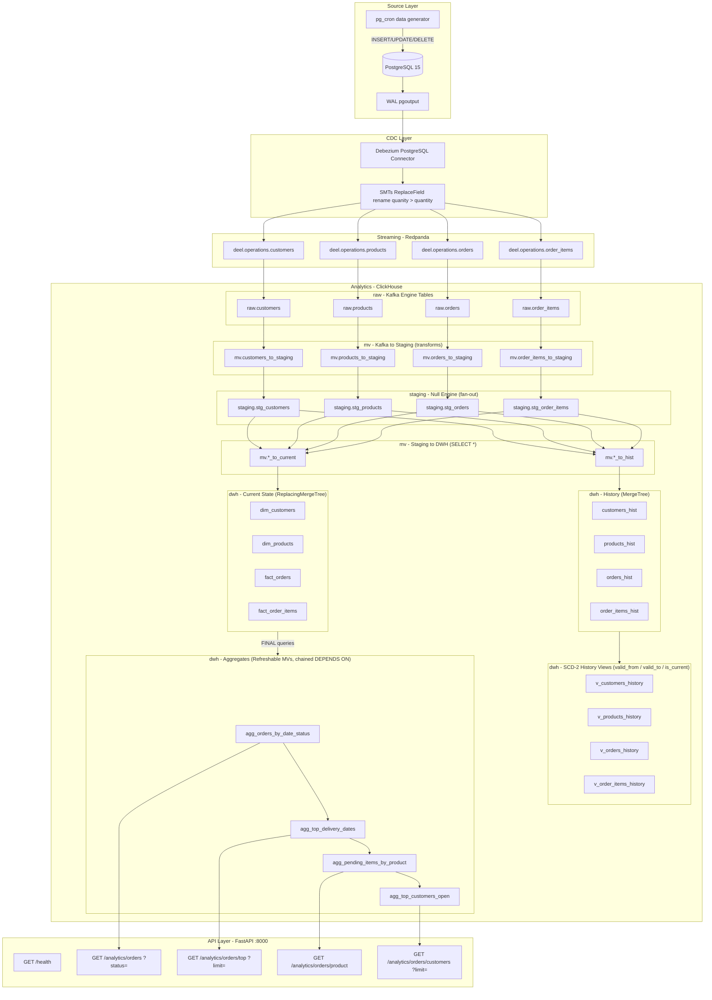

```mermaid
flowchart TB
  subgraph source["Source Layer"]
    direction TB
    pg[(PostgreSQL 15)]
    pgcron[pg_cron data generator]
    pgcron -->|INSERT/UPDATE/DELETE| pg
    wal[WAL pgoutput]
    pg --> wal
  end

  subgraph cdc["CDC Layer"]
    debezium[Debezium PostgreSQL Connector]
    smt[SMTs ReplaceField rename quanity > quantity]
    wal --> debezium
    debezium --> smt
  end

  subgraph streaming["Streaming - Redpanda"]
    direction TB
    t1[deel.operations.customers]
    t2[deel.operations.products]
    t3[deel.operations.orders]
    t4[deel.operations.order_items]
    smt --> t1 & t2 & t3 & t4
  end

  subgraph clickhouse["Analytics - ClickHouse"]
    direction TB

    subgraph raw["raw - Kafka Engine Tables"]
      r1[raw.customers]
      r2[raw.products]
      r3[raw.orders]
      r4[raw.order_items]
    end

    subgraph mv_kafka["mv - Kafka to Staging (transforms)"]
      mvk1[mv.customers_to_staging]
      mvk2[mv.products_to_staging]
      mvk3[mv.orders_to_staging]
      mvk4[mv.order_items_to_staging]
    end

    subgraph stg["staging - Null Engine (fan-out)"]
      s1[staging.stg_customers]
      s2[staging.stg_products]
      s3[staging.stg_orders]
      s4[staging.stg_order_items]
    end

    subgraph mv_fanout["mv - Staging to DWH (SELECT *)"]
      mvf1[mv.*_to_current]
      mvf2[mv.*_to_hist]
    end

    subgraph dwh_cur["dwh - Current State (ReplacingMergeTree)"]
      dim_c[dim_customers]
      dim_p[dim_products]
      fact_o[fact_orders]
      fact_oi[fact_order_items]
    end

    subgraph dwh_hist["dwh - History (MergeTree)"]
      hist_c[customers_hist]
      hist_p[products_hist]
      hist_o[orders_hist]
      hist_oi[order_items_hist]
    end

    subgraph dwh_scd2["dwh - SCD-2 History Views (valid_from / valid_to / is_current)"]
      v_cust[v_customers_history]
      v_prod[v_products_history]
      v_ord[v_orders_history]
      v_oi[v_order_items_history]
    end

    subgraph dwh_agg["dwh - Aggregates (Refreshable MVs, chained DEPENDS ON)"]
      agg_open[agg_orders_by_date_status]
      agg_top[agg_top_delivery_dates]
      agg_prod[agg_pending_items_by_product]
      agg_cust[agg_top_customers_open]
      agg_open --> agg_top --> agg_prod --> agg_cust
    end

    t1 --> r1
    t2 --> r2
    t3 --> r3
    t4 --> r4

    r1 --> mvk1
    r2 --> mvk2
    r3 --> mvk3
    r4 --> mvk4

    mvk1 --> s1
    mvk2 --> s2
    mvk3 --> s3
    mvk4 --> s4

    s1 & s2 & s3 & s4 --> mvf1
    s1 & s2 & s3 & s4 --> mvf2

    mvf1 --> dwh_cur
    mvf2 --> dwh_hist

    dwh_cur -->|"FINAL queries"| dwh_agg
    dwh_hist --> dwh_scd2
  end

  subgraph api["API Layer - FastAPI :8000"]
    direction TB
    health["GET /health"]
    ep1["GET /analytics/orders ?status="]
    ep2["GET /analytics/orders/top ?limit="]
    ep3["GET /analytics/orders/product"]
    ep4["GET /analytics/orders/customers ?limit="]
  end

  agg_open --> ep1
  agg_top --> ep2
  agg_prod --> ep3
  agg_cust --> ep4
```
